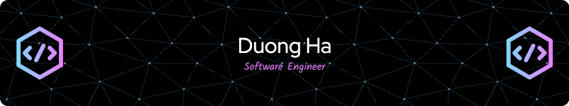

   

        
      

   
   
 
     

        
     

      
        
        
        
      

<h2 align="left">👨‍💻 Languages, Frameworks, Tools</h2>
 

    
     

 

<h2 align="Left">🏋️‍♂️ Stats</h2>
 

  
  
   
  

  
